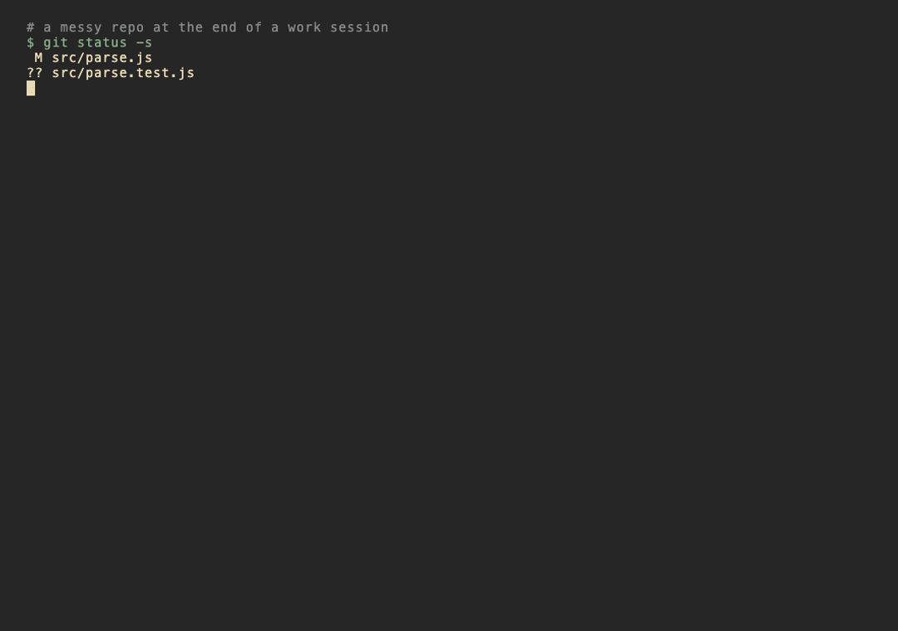

# signoff

**Stop losing context between Claude Code sessions.** `/signoff` is the command
you run when you're done working: it commits your changes, prunes finished
worktrees, syncs your issue tracker, and — the part nothing else does — commits a
**cold-start handoff** so the *next* session picks up with full intent.

It's local-only — no server, nothing leaves your machine. The only hard
dependency is `git`; issue-tracker sync is optional and uses whatever CLI you
already have.

```
/signoff
```

<!-- TODO before publishing: record an asciinema/GIF of a real run and drop it at
     docs/demo.gif, then uncomment the line below. A broken image tag hurts more
     than no image, so it stays commented until the asset exists. -->
<!--  -->

## Why another session tool?

Memory MCPs and Pro/Max session-memory remember for **one machine** and store to
an opaque local DB — a fresh `git clone` (a teammate, a cloud/container run, your
second laptop) never sees them. `signoff` **commits** the handoff, so continuity
travels with the repo. The handoff is a human-readable prompt you can also just
read yourself.

- **Portable** — the handoff is a committed file, so any cold session on any
  machine can resume from it.
- **Complete** — one command covers commit, worktree hygiene, tracker sync,
  loose-ends audit, session summary, and the handoff. Most "wrap up" prompts stop
  at "commit and summarize."
- **Honest about privacy** — public repo? Summaries + handoff are written locally
  and gitignored automatically, never pushed.
- **Safe to try** — `--dry-run` shows exactly what it *would* do and writes
  nothing.

## Install

### As a plugin (recommended — one command)

```
/plugin marketplace add pleasedodisturb/claude-signoff
/plugin install signoff@signoff
```

Then run `/signoff:signoff` (or add it to your workflow).

### As a bare skill (copy-paste)

```
git clone https://github.com/pleasedodisturb/claude-signoff ~/.claude/skills/signoff
```

`~/.claude/skills/signoff/SKILL.md` loads directly and `/signoff` works. (The
`.claude-plugin/` folder is harmless when used this way.)

## Requirements

| | |
|---|---|
| **Required** | `git`; Claude Code **≥ 2.1.142** (root-`SKILL.md` plugin discovery). |
| **Optional** | `gh` — for GitHub Issues sync **and** to auto-detect repo visibility. Without it, the tool fails safe and treats the repo as public (writes locally, never pushes summaries). |
| **Optional** | Another issue-tracker CLI — a `linear`-style command, or `jira`. Auto-detected; skipped cleanly if none. |
| **Optional** | Git worktrees — pruned only if you use them. |

> **First run:** a few read-only probe commands (`git`, `gh`, `date`) may ask for
> permission the first time. Approve them once. Run `/signoff --dry-run` first to
> watch it work without changing anything.

No memory system, no framework, no config file needed. It degrades gracefully
when the optional pieces are absent.

## Options

```
/signoff --dry-run                 # show the plan, change nothing (do this first)
/signoff --no-tracker              # skip issue-tracker sync
/signoff --no-push                 # commit locally, never push / open a PR
/signoff --summary-dir notes/      # where summaries + HANDOFF.md live (default docs/sessions/)
```

## What it writes

- `docs/sessions/YYYY-MM-DD_<slug>.md` — a scannable session summary.
- `docs/sessions/HANDOFF.md` — the cold-start prompt for the next session
  (refreshed every run).

On **public** repos both are written locally and `docs/sessions/` is gitignored,
so private context never ships.

## License

MIT — see [LICENSE](LICENSE).
